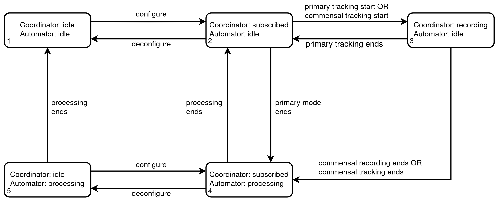

# commensal-automator

Automation for Breakthrough Listen's commensal observing.

The Commensal Automator or `automator` process is designed to enable 
commensal observing and processing cycles to take place without human 
intervention.

### Usage:

```
automator -h

usage: automator [options]

Start the Commensal Automator

optional arguments:

  -h, --help            show this help message and exit

  --redis_endpoint REDIS_ENDPOINT
                        Local Redis endpoint

  --redis_channel REDIS_CHANNEL
                        Name of the Redis channel to subscribe to

  --margin MARGIN       Safety margin for recording duration (sec)

  --hpgdomain HPGDOMAIN
                        Hashpipe-Redis gateway domain

  --buffer_length BUFFER_LENGTH
                        Max recording length at max data rate (sec)

  --partition PARTITION
                        Name of destination partition for seticore output

```

### Operation

The diagrams here try to represent as closely as possible how the system
 functions at the moment (rather than a vision for how the system should 
 function). They will be updated as the system is improved and simplified. 

The automator and coordinator together control recording and processing during
 commensal observations. The following diagram illustrates the possible states
  and state transitions. 



Several different observing scenarios and the associated transitions made by
 the automator and coordinator are illustrated below.


### Dependencies

Requires Python >= 3.5.4

Packages:
```    
numpy >= 1.18.1  
redis >= 3.4.1  
```  

### Installation and Deployment (BLUSE)

Instructions for installation and deployment on the BLUSE headnode:

- Clone repository into desired location: `git clone https://github.com/UCBerkeleySETI/commensal-automator.git`
- `cd commensal-automator`
- Install into the `bluse3.9` virtual environment: `sudo /opt/virtualenv/bluse3.9/bin/python setup.py install` 
- Restart the automator (for now, only when the subarray is deconfigured): `circusctl --endpoint tcp://<IP address>:<port> restart automator`
- If desired, check the automator logs for errors: `less /var/log/bluse/automator/automator.err`

### Installation (generic)

Consider installing within an appropriate virtual environment. 
Then:

`python3 setup.py`

For use as a daemonised process with `circus`, follow these steps:

-    Ensure `automator.ini` is copied to the correct location (eg 
     `/etc/circus/conf.d/automator/automator.ini`)

-    Ensure the environment initialisation file refers correctly to the 
     `automator.ini` file, eg:

     ```
     [env:automator]
     VE_DIR = /opt/virtualenv/<env_name>
     VE_VER = <env version>
     ```

-    Ensure logging is set up correctly and that a location for the log files
     exists, eg:  

     `mkdir /var/log/bluse/automator`

-    Run `circusctl --endpoint <endpoint> reloadconfig`

-    Run `circusctl --endpoint <endpoint> start automator`

### Coordinator requirements  

Notes on transplanting/subsuming the coordinator from 
`meerkat-backend-interface` to the automator. 

Requirements:  

- katsdptelstate >= 0.11: https://github.com/ska-sa/katsdptelstate


