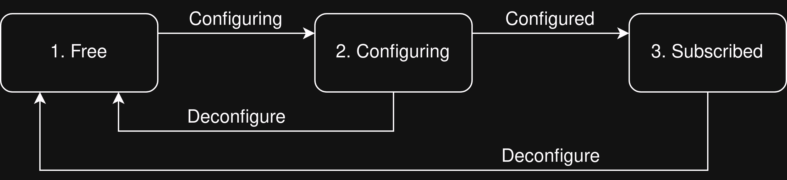
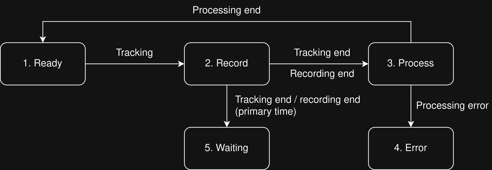

# commensal-automator

Automation for Breakthrough Listen's commensal observing.

The `coordinator` is designed to enable commensal observing and processing
cycles to take place without human intervention. It consists of a central
`coordinator` process, designed to run on a head node, which controls
processing on many processing nodes or instances via ZMQ. Each processing
node or instance has a copy of the `bluse_analyzer` process, controlled by
circus using ZMQ. Transfer of metadata is handled via Redis. 


## Usage:

Headnode `coordinator` process:  
```
usage: coordinator [options]

Start the coordinator

optional arguments:
  -h, --help       show this help message and exit
  --config CONFIG  Config file location.

```

Instance-specific `bluse_analyzer` process:  
```
usage: bluse_analyzer [options]

Run processing actions for specified instance.

optional arguments:
  -h, --help            show this help message and exit
  -I INSTANCE, --instance INSTANCE
                        Current instance number.
```

## Operation

The coordinator controls recording and processing during commensal 
observations. For each active subarray, two separate state machines are
instantiated and run. The first controls processing node/instance allocation
and multicast group subscriptions. The second controls recording, processing
and other ancillary tasks.

### `FreeSubscribed` states:



### `RecProc` states:



### Instance allocation:

The diagram below provides a simplified example of instance allocation, in
which there are 7 instances and three subarrays. Three instances are
unassigned, while two each are assigned to `array_1` and `array_2`. `array_3`
does not have any instances allocated to it.


The boxes and lines in different colours indicate the sets of instances that
are shared between state machines. There is only one `free` set, which is
shared by all `freesubscribed` machines. Each subarray's `freesubscribed` and
`recproc` machines share a `subscribed` set. State changes are resolved in
sequence, so each machine has its own turn to move instances between sets.

### State saving and loading

The states of each subarray's state machines (`recproc` and `freesubscribed`)
are saved in Redis as a dictionary in JSON. This takes place every time a
state change occurs. On startup, for each subarray, the coordinator checks to
see if state data has been saved previously. If so, it initialises each state
machine with the appropriate state and instance allocation, recreating the
last known configuration when the coordinator was last active. This allows the
coordinator to recover from interruptions, or for modifications to be made in
the midst of an active subarray.

State data is saved under several keys. The first is saved in Redis under the
key `free_instances`. This is a JSON-formatted list of all unassigned
instances, for example:

```
["blpn0/0", "blpn1/0", "blpn2/0" ...]
```

The state of each `freesub` machine is stored under the Redis key
`<array>:freesub_state`.  

The remaining state data is saved for each subarray under the key
`<array name>:state`. The structure of the (JSON-formatted) dictionary is as
follows:

```
state_data = {
    "recproc_state": <state name>,
    "subscribed": <list of instances>,
    "ready": <list of instances>,
    "recording": <list of instances>,
    "processing": <list of instances>,
    "timestamp": <timestamp of data>
}
```

If these keys are not available in Redis, the coordinator assumes all
`recproc` machines are in the `READY` state, with all instances stored
in `ready`, and that all `freesubscribed` machines are in the `FREE`
state, with all instances stored in `free`.

## Installation and Deployment (BLUSE)

Instructions for installation and deployment on the BLUSE headnode:

- Clone repository into desired location: `git clone https://github.com/UCBerkeleySETI/commensal-automator.git`
- `cd commensal-automator`
- Install into the `automator` virtual environment: `sudo /opt/virtualenv/automator/bin/python setup.py install` 
- Start the automator: `circusctl --endpoint tcp://<IP address>:<port> start automator`
- If desired, check the automator logs for errors: `less /var/log/bluse/automator/automator.err`

## Installation (generic)

Consider installing within an appropriate virtual environment. 
Then:

`python3 setup.py`

For use as a daemonised process with `circus`, follow these steps:

-    Ensure `coordinator.ini` is copied to the correct location (eg 
     `/etc/circus/conf.d/coordinator/coordinator.ini`)

-    Ensure the environment initialisation file refers correctly to the 
     `coordinator.ini` file, eg:

     ```
     [env:automator]
     VE_DIR = /opt/virtualenv/<env_name>
     VE_VER = <env version>
     ```

-    Ensure logging is set up correctly and that a location for the log files
     exists, eg:  

     `mkdir /var/log/bluse/coordinator`

-    Run `circusctl --endpoint <endpoint> reloadconfig`

-    Run `circusctl --endpoint <endpoint> start coordinator`

## Dependencies

```
Python >= 3.9.12
pyzmq >= 25.0.0
PyYAML >= 6.0
katsdptelstate >= 0.11 (see https://github.com/ska-sa/katsdptelstate)
redis >= 3.4.1
requests == 2.28.1
numpy >= 1.18.1
circusd >= 0.12.1
```

## Running the coordinator alongside the old automator/coordinator

This is specific to the BLUSE configuration. To switch from the existing
automator/coordinator to the new coordinator:

```
source /opt/virtualenv/automator/bin/activate
cd scripts 
./stop.sh coordinator
./stop.sh automator
./start.sh new_coordinator
```

The `new_coordinator` log files are available here:

```
/var/log/bluse/new_coordinator
```

The `bluse_analyzer` log files are available in `/tmp` on each processing
node. The log files are written as: `bluse_analyzer.<instance #>.err` and
`bluse_analyzer.<instance #>.out`.

To switch back to the original automator/coordinator:

```
source /opt/virtualenv/automator/bin/activate
cd scripts 
./stop.sh new_coordinator
./start.sh coordinator
./start.sh automator
```
