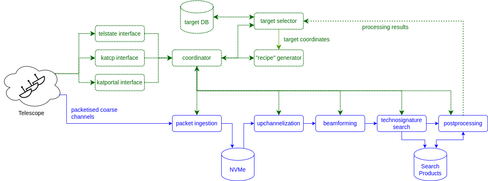

# BLUSE System Overview

The above diagram provides a high-level outline of the entire system. The high-speed data processing pipeline begins with subscriptions to the appropriate F-engine multicast groups and receiving incoming UDP packets. MeerKAT offers 3 receivers (UHF, L- and S-band) and three wide-band observing modes (1k, 4k and 32k) as well as a narrowband “zoom” mode. We do not make use of the zoom mode, as we need to upchannelise further across the entire band, and the wide-band modes are always available. The S-band receivers offer more bandwidth than the F-engines process, so the band is split into 5 overlapping bands (S0 to S4). The observing modes and their associated parameters are retrieved by the automation and interfacing software. The data rate output by each antenna’s F-engine varies by the bandwidth of each observing mode. At L-band, for example, the data rate produced by a single antenna’s F-engine is 856 MHz × 8 bits × 2 (complex) × 2 polarisations = 27.392 Gbps, or approximately 1.753 Tbps for a full array of 64 antennas. The actual datarate that traverses the network is higher due to networking overhead: for every 1024 bytes of data, the Ethernet/IP/UDP packet headers add 42 bytes and the SPEAD2 header adds 96 bytes. Therefore, the total data rate to be received by one processing instance is approximately 31.08 Gbps at L-band when all 64 antennas are in use.

Each processing pipeline instance handles an amount of incoming data equivalent to that produced by one MeerKAT antenna. However, the data received by each instance (via the multicast groups) consists of a common segment of bandwidth (1/64th) repeated for every antenna. Thus, each instance is responsible for upchannelizing, beamforming and searching 1/64th of the full bandwidth. 

SPEAD2 packets are received by hpguppi daq instances, the payload voltages assembled into GUPPI RAW blocks, and written to NVMe modules in RAID 0 to manage the incoming data rate. The use of NVMe modules permits much deeper buffers than would be feasible with RAM.We investigated the performance and write endurance of different drives for our specific use case: sequentially writing to the disks to capacity, reading the data back, and deleting all of the data. Using purpose-built software, we tested various drives under consideration to failure and found their longevity to be sufficient.

## Calibration

Fortunately, BLUSE can rely upon calibration solutions produced for the primary observer by MeerKAT’s Science Data Processor. The MeerKAT calibration pipelines are discussed extensively in the MeerKAT External Service Desk Knowledge Base. Upon commencing a recording, BLUSE retrieves the latest calibration solutions from TelState and supplies them to the beamformer for application.

## Upchannelisation and Beamforming

For each instance, the incoming data are further channelized to approximately 1Hz resolution, which we refer to as “upchannelization”. Such high frequency resolution enables the detection of extremely narrowband signals, which cannot be produced by known natural astrophysical processes; for example, the most narrowband maser line is 550 Hz.

Following upchannelization, each instance then forms the desired synthesized beams on targets within the primary field of view. BLUSE currently forms 64 beams per 290 second primary pointing. The calibration solutions obtained from TelState and the coordinates for the 64 targets chosen in the primary field of view are written to an HDF5-based file by the bfr5 generator process. We refer to this file as a “beamformer recipe file”. The bfr5 generator also calculates delays and delay rates for each beam (relative to the boresight pointing, which the F-engines track in delay and phase) at 1 second intervals over the duration of the recording and writes them into this beamformer recipe file for later access by the beamformer.

## Technosignature search

A relatively standard Taylor-tree narrowband de-Doppler drift search is conducted on the beamformed data, using seticore. We use a drift rate range of ±10 Hz/s, and intend to ex-
pand this to larger values in future. We use an initial SNR threshold of 6, but anticipate varying this significantly in future. Adjusting this threshold directly affects the rate at which candidate signal “hits” are recorded for further analysis, and thus the rate at which BLUSE consumes available storage space.

## Data products

In addition to the stamp and hit files, several other data products are recorded. At a user-specified interval filterbank-formatted hdf59 files are saved for the incoherent sum of all antennas as well as each synthesized beam. These are useful for the development of student projects (such as ML-based RFI rejection approaches) and for system validation and diagnostics. Finally, for the rare occasions on which BLUSE is used for direct primary observing, all the raw F-engine voltages are saved for later re-analysis in full. The figure below provides an example of the contents of a single stamp file. The same time-frequency region of the upchannelized voltage data from each participating antenna is
extracted and saved. In this observation, 62 antennas were available.

